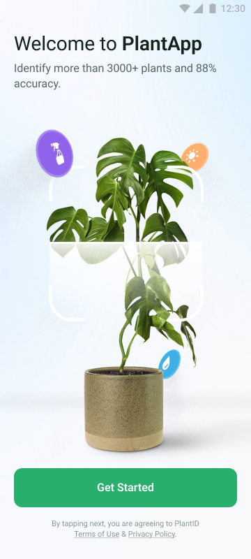
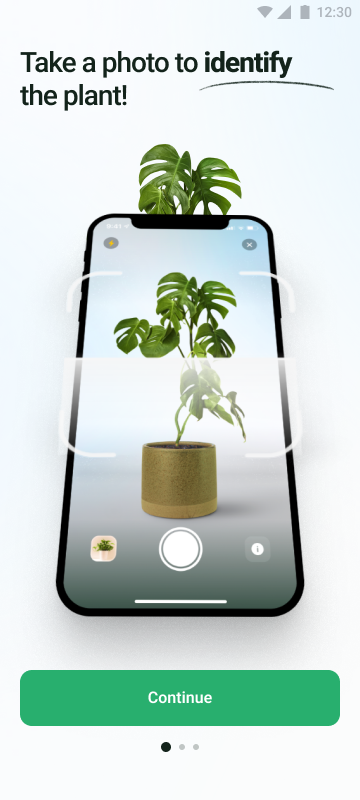
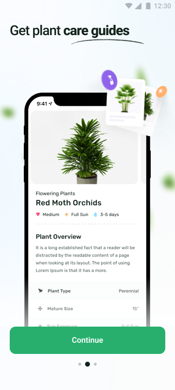
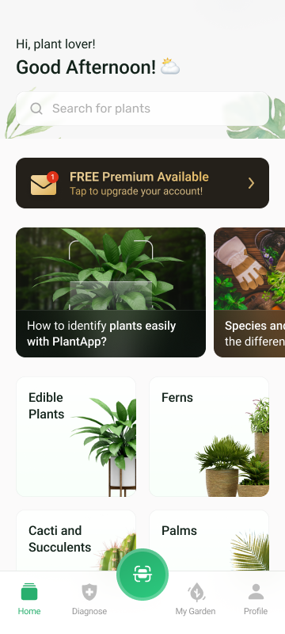
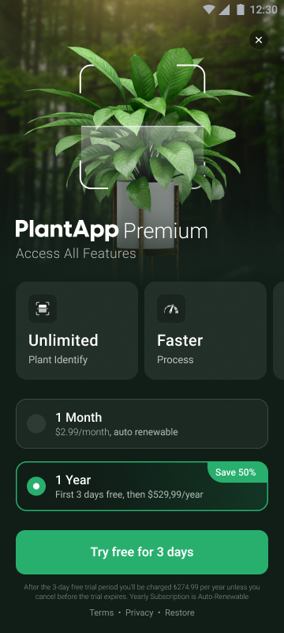

# PlantApp

## Proje Açıklaması

PlantApp, kullanıcıların bitkileri tanımlamasına, bitki bakım rehberlerine ulaşmasına, kişisel bitki koleksiyonlarını (bahçelerini) yönetmesine ve bitki hastalıklarını teşhis etmesine yardımcı olan bir mobil uygulamadır.

Uygulama, kullanıcılara akıcı bir başlangıç deneyimi sunan bir onboarding akışı ve bitki tanımlama için kamera entegrasyonu gibi özellikler içermektedir. MVVM (Model-View-ViewModel) mimarisi kullanılarak geliştirilmiş olup, güncel Android geliştirme pratiklerini ve teknolojilerini içermektedir.

## İçerikler

- Bitki tanımlama (Fotoğraf çekerek)
- Bitki bakım rehberleri
- Kişisel bitki bahçesi yönetimi
- Bitki hastalığı teşhisi
- Kullanıcı profili
- Onboarding akışı

## 🚀 Özellikler

- 🏗️ MVVM Mimarisi
- 🎯 Kotlin Coroutines
- 🧩 Hilt Dependency Injection
- 🖼️ Glide Image Loading
- 📱 Material Design 3
- 🔄 ViewBinding
- 🎨 Custom Tema ve Stil Desteği
- 📦 Modüler Yapı

## 🛠️ Teknolojiler

- Kotlin
- Android Jetpack
- Hilt
- Coroutines
- Glide
- Material Design 3
- ViewBinding

## 📋 Gereksinimler

- Android Studio Arctic Fox veya üzeri
- Android SDK 24+
- Kotlin 1.8.0+
- Gradle 7.0+

## 🚀 Kurulum

1. Projeyi klonlayın:
```bash
git clone https://github.com/dodoizgi/plantapp.git
```

2. Android Studio'da projeyi açın

3. Gradle sync işlemini tamamlayın

4. Uygulamayı çalıştırın

## 📁 Proje Yapısı

```
app/
├── data/                  # Veri katmanı
│   ├── api/              # API servisleri ve ağ istekleri
│   ├── repository/       # Repository implementasyonları
│   └── model/           # Veri modelleri
├── domain/              # Domain katmanı
│   ├── model/          # Domain modelleri
│   ├── repository/     # Repository interfaces
│   └── usecase/        # Use case'ler
├── presentation/        # UI katmanı
│   ├── base/           # Base sınıflar
│   ├── home/           # Ana ekran
│   ├── diagnose/       # Teşhis ekranı
│   ├── mygarden/       # Bahçe yönetimi
│   └── profile/        # Profil ekranı
├── di/                 # Dependency Injection modülleri
```

## 🎨 Tema ve Stil

Proje, Material Design 3 prensiplerini takip eden özelleştirilmiş bir tema kullanmaktadır:

- Light/Dark tema desteği
- Dinamik renk desteği
- Özelleştirilmiş tipografi
- Tutarlı spacing ve elevation değerleri

## Testler

Projeye temel testler eklenmiştir:

- **Unit Testler:** MainActivity ve Fragment'lar için temel unit test yapıları (`app/src/test/`) (Şu anda boş veya placeholder testler içermektedir).
- **UI Testler:** MainActivity ve Onboarding ekranları için Espresso ile yazılmış UI testleri (`app/src/androidTest/`).

UI testlerini çalıştırmak için:
```bash
./gradlew connectedAndroidTest
```

Unit testlerini çalıştırmak için:
```bash
./gradlew test
```

## Ekran Görüntüleri

Uygulamadan bazı ekran görüntüleri:

**Onboarding Ekranları:**







**Ana Ekran:**



**Paywall Ekranı:**



## 🤝 Katkıda Bulunma

1. Bu depoyu fork edin
2. Feature branch'i oluşturun (`git checkout -b feature/amazing-feature`)
3. Değişikliklerinizi commit edin (`git commit -m 'feat: Add some amazing feature'`)
4. Branch'inizi push edin (`git push origin feature/amazing-feature`)
5. Pull Request oluşturun

## 📝 Lisans

Bu proje MIT lisansı altında lisanslanmıştır. Detaylar için [LICENSE](LICENSE) dosyasına bakın.

## 📞 İletişim

Proje Sahibi - [@github_dodoizgi](https://github.com/dodoizgi)

Proje Linki: [https://github.com/dodoizgi/PlantApp](https://github.com/dodoizgi/PlantApp) 